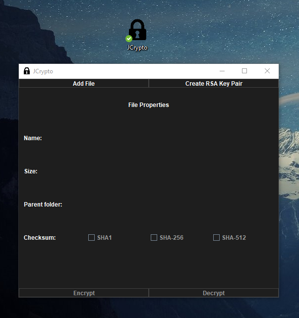
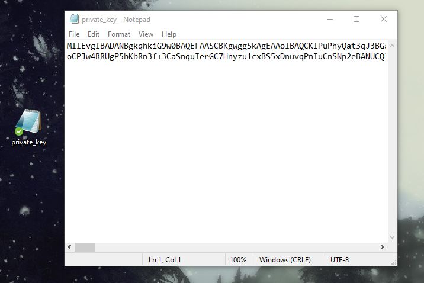
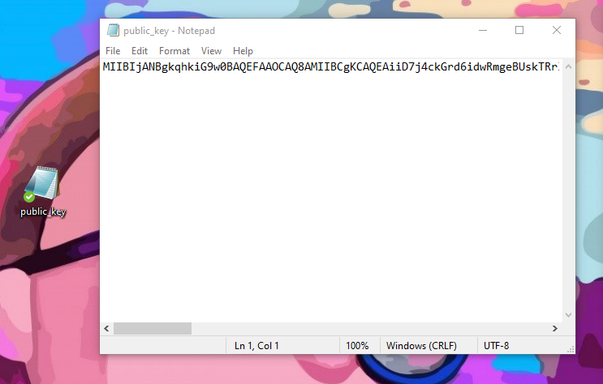
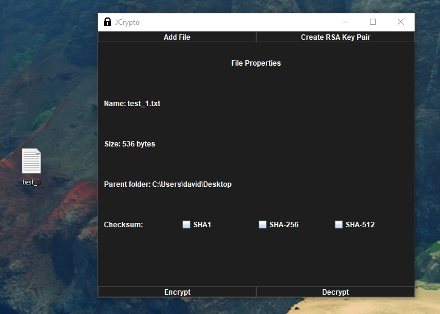
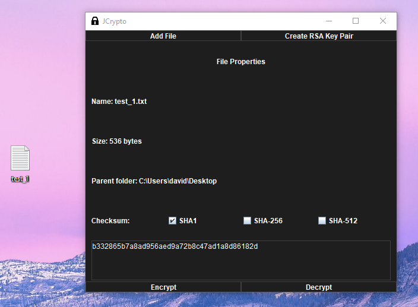
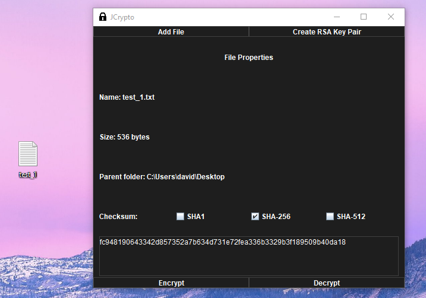
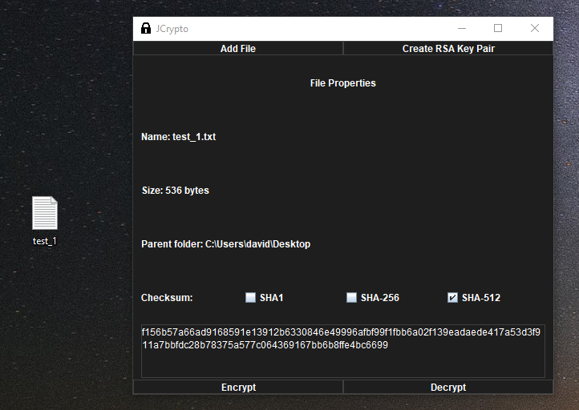
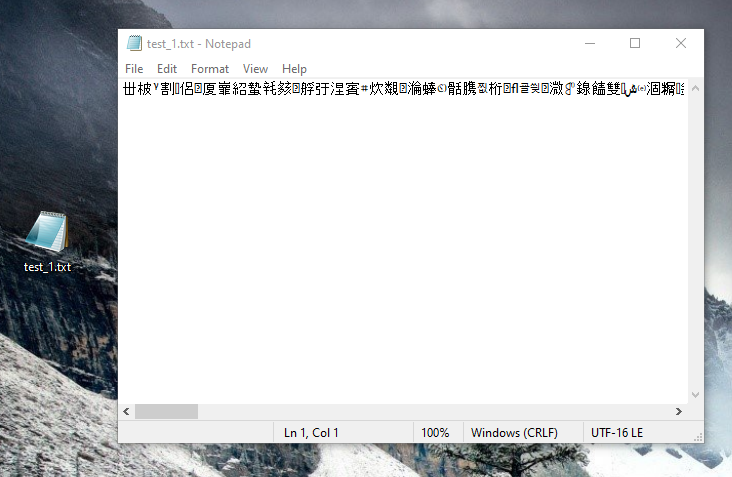

# JCrypto
## Java tool to encrypt and decrypt files and directories with AES and RSA keys

## Features
- Generation of RSA key pair
- Generation of the checksum of a given file
- Encryption with "on the spot" generated RSA and AES keys
- Encryption with provided RSA keys
- Decryption of encripted file of the same format

## How does it work ?
### Encryption
> This program consist in combining the strengths of AES and RSA algorithms, it does this by encrypting a file of chosen by the user 
> using a randomly created AES key, encrypting said key with a 2048 bit size RSA key, and writing the encrypted AES key and the 
> encrypted file to the one combined file.
> The RSA key that encrypts the AES one can be created at the moment of encryption on loaded by the user
> The RSA keys will be saved to texts file in Base64 format for ease of use.

### Decryption
> When decrypting a file, this one has to be in the same format has this program encrypts one, since for security reasons the AES key
> is never revealed and it's encrypted version written to the encrypted file. 
> The program will read the file and search for the encrypted AES key, when found it will use a user provided RSA key (that also has to 
> be in the same format that the program creates and saves them) to decrypt the it and then use this AES key to decrypt the content of  
> the file.

### Checksum
> You can visualize the checksum of any file in SHA1, SHA256 or SHA512

## Examples
> ### Program UI
>
>

> ### Private key example
>
>

> ### Public key example
>
>

> ### File loaded
>
>

> ### File Checksums
>
>
>
>

> ### Final combined file
>
>

